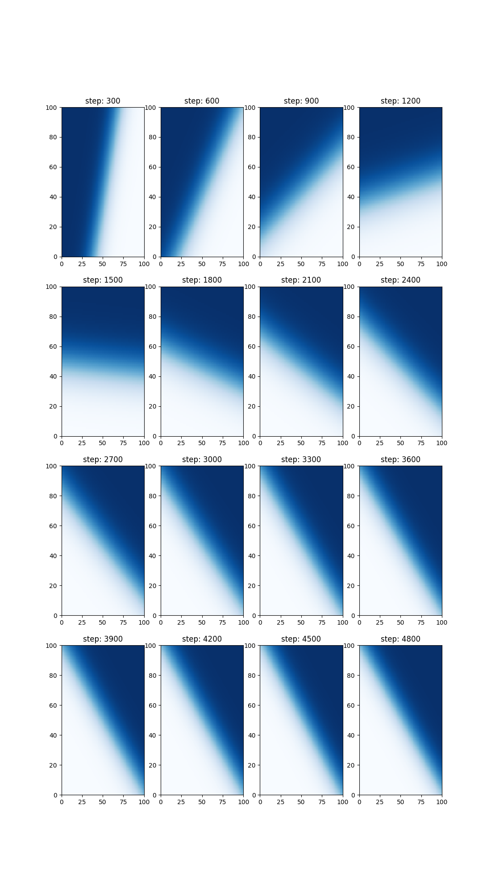
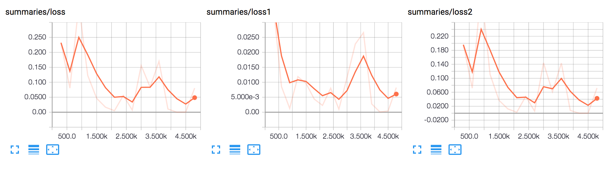

# multi-instance learning

## Run

Execute the script to train a linear decision boundary and generate the above heatmaps.

```
$ python3 mitr.py
```

View tensorboard plots at localhost:6006

```
$ tensorboard --logdir=mitr/mitr_logs
```


## Concepts

Based on the paper: 
http://mdenil.com/media/papers/2015-deep-multi-instance-learning.pdf


Conventially supervised learning is given a set of labels `y_i` for corresponding inputs `x_i`, and asked to predict new outputs `y'`.

In multi-instance learning the labels `l_I` are given for corresponding sets of inputs `{x}_I`, and the algorithm must predict individual new outputs `y'`.


In this implementation a linear class boundary is learned by being passed random uniform subsets `{x}_I` as inputs and given the fraction interesecting the positive class as labels `l_I`. 

The loss function consists of two terms; one a similarity term on inputs and the other a group loss term:

```

L = 1 / N^2 * K_ij * P_ij  + 1 / G * Q_kk

where
    K_ij := pairwise kernel over individual inputs    
    P_ij: pairwise loss over predicted individual outputs
    Q_ij := pairwise loss between predicted and atual group outputs
    N := number of individual training inputs (batch size)
    G := number of group training inputs (group batch size)

```

#### Learned decision boundaries 	at successive training iterations

#### Training loss



